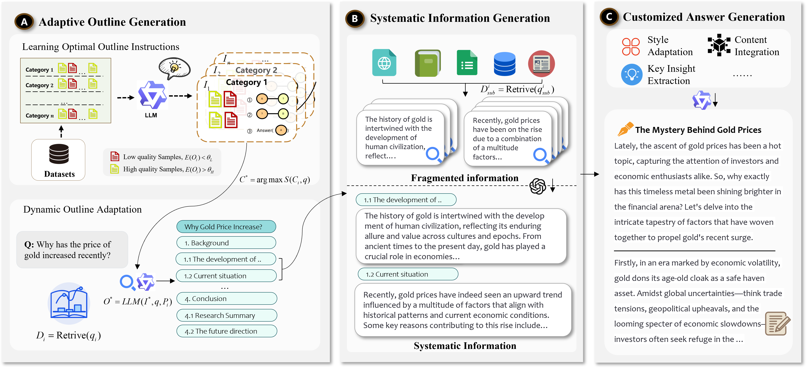
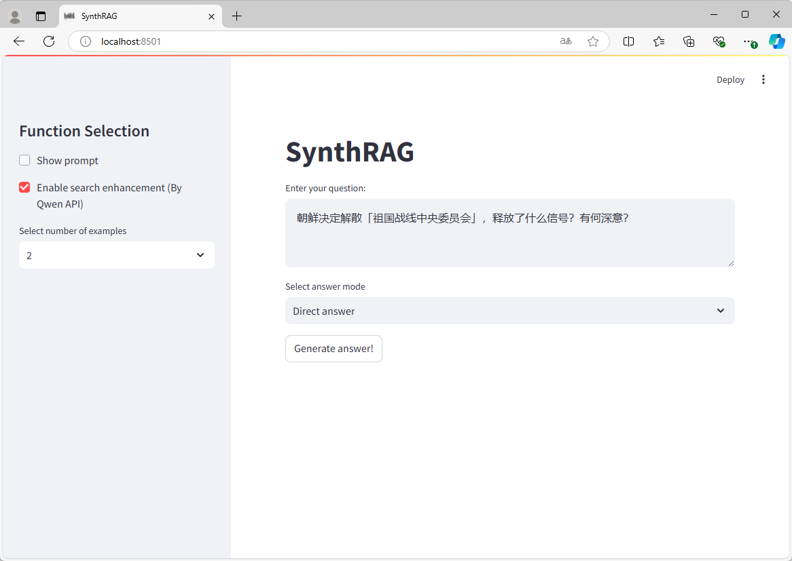

# SynthRAG: An Adaptive Framework for Generating Systematic Explanatory Answers


## Introduction

SynthRAG is an innovative framework designed to enhance Question Answering (QA) performance by creating adaptive outlines, generating systematic information, and producing customized answers. This repository contains a minimal demo implementation of the SynthRAG framework. 

[Paper Link
](https://arxiv.org/abs/2410.17694)





## Features

- Adaptive outline generation based on question types
- Systematic information retrieval and generation
- Customized answer generation
- Integration with large language models (LLMs)
- Parallel processing for efficient content generation
- Evaluation metrics for answer quality assessment




## Installation

1. Clone the repository:
   ```
   git clone https://github.com/czy1999/SynthRAG.git
   cd SynthRAG
   ```

2. Install the required dependencies:
   ```
   pip install -r requirements.txt
   ```

3. Add Qwen API key:
   ```
   export QWEN_API_KEY="your_qwen_api_key"
   ```

   Note: The Qwen API key enables access to the Qwen-Max model and its search capabilities.
   You can obtain your Qwen API key through the [Dashscope platform](https://dashscope.aliyun.com/).


## Usage

### Running the SynthRAG Demo

To run the SynthRAG demo using Streamlit:

```
streamlit run main.py
```

This will launch a web interface where you can interact with the SynthRAG framework.

### Using SynthRAG in Your Project

To use SynthRAG in your own project, you can import the `SynthRAG` class from `model.py`:


```python
from SynthRAG.model import SynthRAG
syn = SynthRAG()
query = "Your question here"
syn.process(query)
```


## Contributing

We welcome contributions to the SynthRAG project. Please feel free to submit issues, feature requests, or pull requests.

## Citation

If you use SynthRAG in your research, please cite our paper
```latex
@misc{chen2024adaptive,
    title={An Adaptive Framework for Generating Systematic Explanatory Answer in Online Q&A Platforms},
    author={Ziyang Chen and Xiaobin Wang and Yong Jiang and Jinzhi Liao and Pengjun Xie and Fei Huang and Xiang Zhao},
    year={2024},
    eprint={2410.17694},
    archivePrefix={arXiv},
    primaryClass={cs.CL}
}
```

